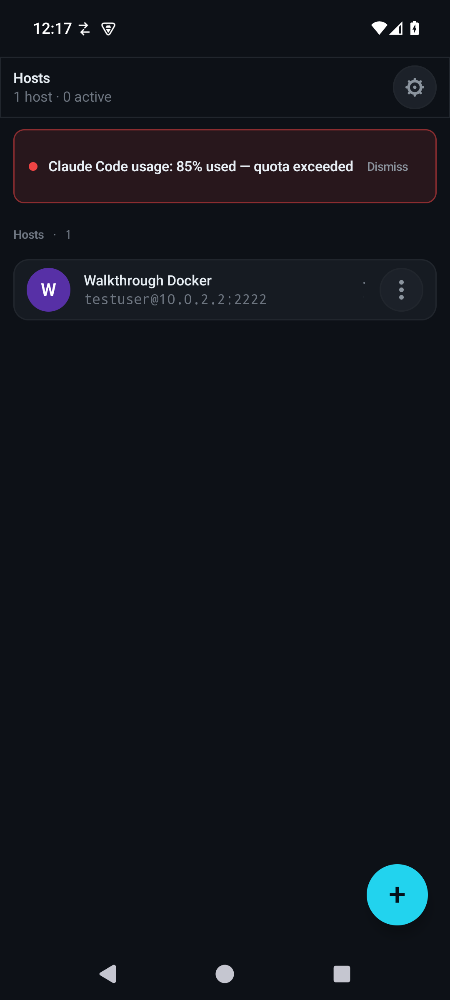
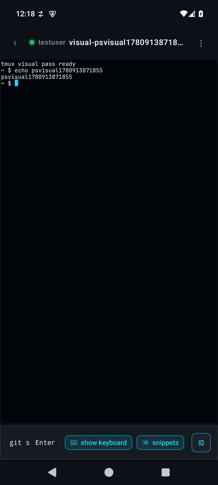
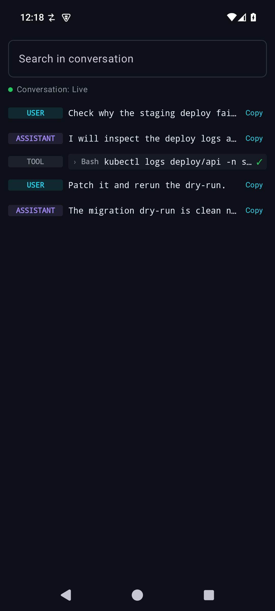
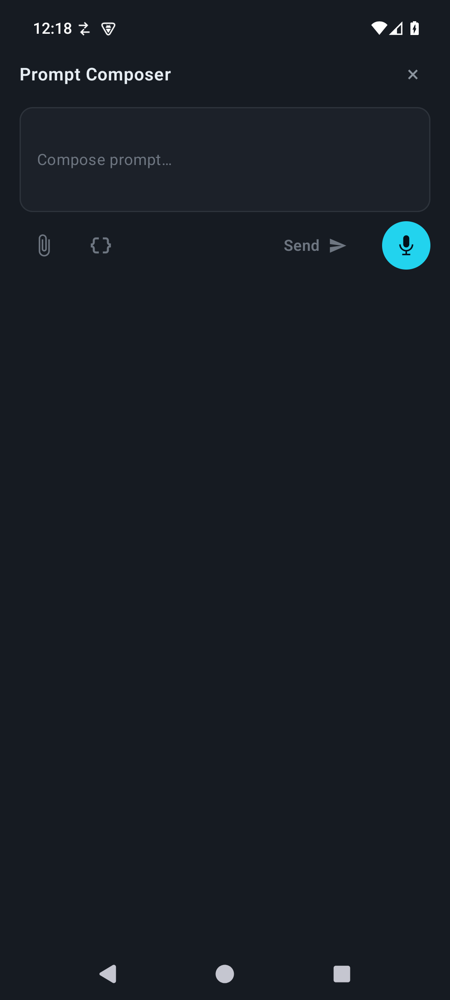
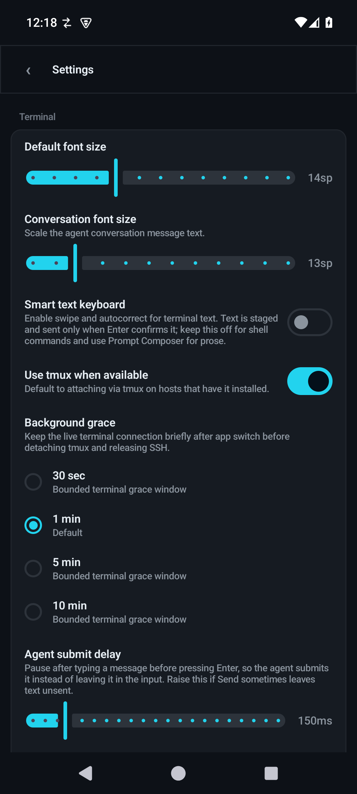

# PocketShell

PocketShell is a voice-first, tmux-native, agent-aware Android SSH client. It
connects your phone to the developer workstation you already use over SSH,
attaches to your **tmux** sessions in control mode, and gives you a phone-shaped
way to drive shells and AI coding agents (Claude Code, Codex, OpenCode) without
typing everything by hand.

It is built for one job: keep working on your dev box from your phone. Long-lived
state lives on the dev box in tmux and a small server-side `pocketshell` helper;
the app reconnects when you bring it back to the foreground.

## Status

**Active development, dogfooded daily.** This isn't a finished product or a
planning exercise — PocketShell is the maintainer's primary way of working on a
dev box from a phone, and every release comes out of that real, constant use.
The current release is **v0.4.21**
([releases](https://github.com/alexeygrigorev/pocketshell/releases)); grab the
debug APK from the latest release to try it. It's Android-only and single-user,
and it takes hard cuts on breaking changes rather than carrying compatibility
shims — there is no install base to keep happy (locked decision
[D22](docs/decisions.md)).

## What it does

- **tmux-native sessions.** Attaches with `tmux -CC` control mode and renders one
  pane at a time in a real terminal emulator, instead of trying to read a tiled
  tmux layout on a small screen. Swipe/navigation controls move between panes.
- **Agent awareness.** Detects Claude Code, Codex, and OpenCode running in the
  visible tmux pane and shows a clean Conversation view of that agent's turns,
  tool calls, and output, with a reply composer that sends back into the pane.
- **Voice-first input.** A composer with OpenAI Whisper and the Android speech
  recognizer turns dictation into commands or agent prompts. A key bar adds Esc,
  Tab, Ctrl, Alt, and arrows above the keyboard; per-host snippets and prompt
  templates cut down typing further.
- **Host management.** Save SSH hosts, import or generate keys, unlock key
  passphrases biometrically, and import a host from a **QR code**.
- **Server-side helpers, zero phone-side credentials.** Provider usage/quota,
  repo browsing, env management, and jobs run through the `pocketshell` helper on
  the dev box, so provider credentials never move onto the phone.
- **More.** Remote file browse/view, per-host port forwarding, attachment upload,
  and a dense dark dev-tool UI.

Deeper docs live in [docs/README.md](docs/README.md) (architecture, agent
awareness, usage panel, design system, testing).

## Screenshots

Captured from the visual-audit emulator workflow against the deterministic Docker
SSH fixture (`scripts/phone-walkthrough.sh visual-audit`).

<table>
  <tr>
    <td></td>
    <td></td>
    <td></td>
  </tr>
  <tr>
    <td align="center">Hosts</td>
    <td align="center">tmux terminal</td>
    <td align="center">Conversation</td>
  </tr>
  <tr>
    <td></td>
    <td></td>
    <td></td>
  </tr>
  <tr>
    <td align="center">Prompt composer</td>
    <td align="center">Settings</td>
    <td></td>
  </tr>
</table>

## Install

### 1. Install the Android app

1. Open the [GitHub Releases page](https://github.com/alexeygrigorev/pocketshell/releases)
   and download the latest debug APK (`pocketshell-<version>-debug.apk`).
2. Allow installs from your browser/file manager if your phone prompts, then open
   the APK to install it.

   Or, with `adb`:

   ```bash
   adb install -r pocketshell-<version>-debug.apk
   ```

Requirements: Android 8.0 (API 26) or newer.

### 2. Install the server-side helper on the dev box

The app drives a small Python helper named `pocketshell` on each dev box for
usage/quota, repos, env, jobs, and QR sharing. Install it once per box:

```bash
uv tool install pocketshell
# or
pipx install pocketshell
```

To also generate host QR codes from the dev box, add the QR extra:

```bash
uv tool install pocketshell --with "qrcode[pil]"
```

See [tools/pocketshell/README.md](tools/pocketshell/README.md) and
[docs/server-setup.md](docs/server-setup.md) for PATH and troubleshooting notes.

## Configure a host

You can add a host two ways: scan a QR code (fastest), or enter the details
manually.

### Manual entry

1. On the **Hosts** screen, tap the **+** button.
2. Fill in the host form:
   - **Name** — display name for the host (e.g. `dev box`).
   - **Hostname / IP** — the address to connect to (e.g. `dev.example.com`).
   - **Port** — SSH port, defaults to `22`.
   - **Username** — the SSH user.
   - **SSH key** — pick a key from your saved keys.
   - **Usage command** (optional) — a custom command for the usage panel;
     defaults to `pocketshell usage --json`.
3. Tap **Add host**.

To add keys, open the SSH keys screen and use **Import key** (load an existing
private key from the device) or **Generate** (create a new key on the device).
PocketShell inspects the key locally and prompts for a passphrase when one is
needed; passphrases are not stored.

### QR code import

QR import is the fastest way to set up a host — it carries the host details and,
optionally, the private key, so there is nothing to type on the phone.

**On the dev box**, generate a QR from an SSH config alias (resolves host, port,
user, and identity file via `ssh -G`):

```bash
pocketshell qr-share dev
```

Or pass the details explicitly, skipping `~/.ssh/config`:

```bash
pocketshell qr-share \
  --host dev.example.com \
  --user ubuntu \
  --port 22 \
  --key ~/.ssh/id_ed25519 \
  --name "dev box"
```

`qr-share` prints the QR inline when the terminal is a TTY, or writes a numbered
PNG sequence (`qr-share-01.png`, ...) with `--png --out-dir <dir>`. Large keys
are split across several QR codes automatically; the helper pauses between codes
so you can scan each in turn.

**On the phone**, go to **Settings → Host import → Import host → Scan QR** and
point the camera at the code(s). The scanner reassembles multi-part codes and
imports the host once every part has arrived.

> The QR payload can include your private key, which is a visible secret on the
> screen. Generate and scan QR codes in a private space, prefer
> passphrase-protected keys, and delete any generated PNGs after import.

Full payload format, multi-QR envelope, and the `pocketshell://import?...` deep
link are documented in [docs/ssh-qr-import.md](docs/ssh-qr-import.md).

## Connect

1. Tap a host on the **Hosts** screen.
2. PocketShell connects, checks the `pocketshell` helper version (offering an
   install/upgrade command if needed), and discovers watched folders and tmux
   sessions.
3. Open or create a tmux session. Use the mic/composer, key bar, snippets,
   slash-command palette, Conversation tab, file browser, or port-forward panel
   as needed.

## How it fits together

```text
Android phone                 SSH (sshj)              Dev box
PocketShell UI   tmux -CC control mode ----------->   tmux server
Compose + VT     tail JSONL / SQLite -------------->   agent logs
foreground app   pocketshell commands ------------>   pocketshell helper
```

Load-bearing choices: `tmux -CC` control mode instead of screen-scraping; one
visible pane at a time instead of tiled tmux; server-side helpers so no provider
credentials live on the phone; and a foreground-first model — the app does not
schedule background phone work, it reconnects when you bring it forward (the
active connection has a short app-switch grace window so quick app swaps don't
tear it down). The scoped exception is port forwarding, which uses a foreground
service while tunnels are active.

See [docs/architecture.md](docs/architecture.md) and
[docs/decisions.md](docs/decisions.md) for the full rationale.

## Development

Prerequisites: JDK 17, the Android SDK and platform tools, an emulator image,
Docker with Compose, and a `local.properties` pointing at the SDK:

```properties
sdk.dir=/home/alexey/Android/Sdk
```

Common commands:

```bash
scripts/cgroup-run.sh -- ./gradlew assembleDebug
scripts/cgroup-run.sh -- ./gradlew test --stacktrace
scripts/cgroup-run.sh -- ./gradlew check --stacktrace
scripts/connected-test.sh
```

The test matrix and Docker/emulator setup are in
[docs/testing.md](docs/testing.md) and
[docs/docker-emulator-runbook.md](docs/docker-emulator-runbook.md). The
orchestrator/reviewer process and release flow are in
[process.md](process.md).

## Repository layout

- `app/` — Android application.
- `shared/core-ssh/` — sshj wrapper, leases, key management, remote file APIs.
- `shared/core-connection/` — connect/attach/reattach/grace/reconnect controller.
- `shared/core-portfwd/` — port forwarding.
- `shared/core-tmux/` — tmux control-mode parsing and client behavior.
- `shared/core-terminal/` — vendored Termux terminal emulator + Compose adapter.
- `shared/core-agents/` — Claude Code, Codex, and OpenCode detection/parsers.
- `shared/core-assistant/` — in-app LLM assistant (Anthropic + OpenAI clients, config store).
- `shared/core-usage/` — normalized usage/quota parsing.
- `shared/core-storage/` — Room entities, DAOs, migrations.
- `shared/core-voice/` — Whisper and speech input.
- `shared/ui-kit/` — shared dark design system.
- `tools/pocketshell/` — server-side Python helper published to PyPI.
- `tests/docker/` — deterministic SSH/dev-box test fixtures.
- `docs/` — product docs, architecture notes, and QA runbooks.
</content>
</invoke>
